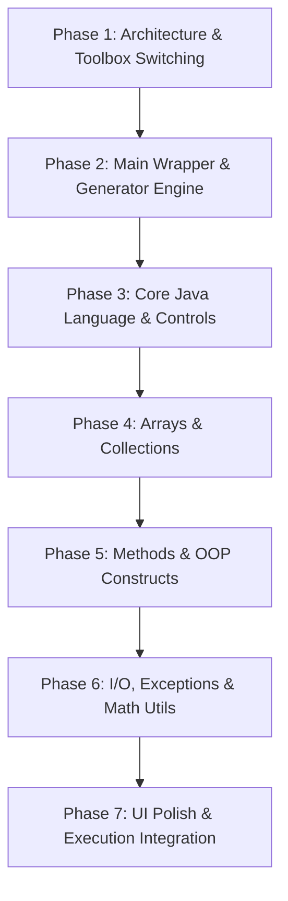

# Implementation Plan: Java Language Module Integration

This document outlines the architecture, specification, and phased development roadmap for implementing the **Java Language Module** in CodeAsthram. The objective is to make Java a first-class language alongside Python, updating the left toolbox, block definitions, code generation engine, and UI code panel when the user selects "Java" from the language dropdown.

---

## Architectural Objectives

1. **Dynamic Toolbox Switching**: When the user selects **Java** in the header dropdown, the left toolbox dynamically updates to present Java-specific categories and universal fundamental blocks adapted for Java syntax.
2. **Robust Code Generation Engine**: Java requires a structured, strongly-typed compilation unit (`public class Main { public static void main(String[] args) { ... } }`). The generator automatically handles package imports, class definitions, method scopes, and proper indentation.
3. **Parity with Python Architecture**: Maintain the exact same UI layout, block snapping/fixing ergonomics, live code generation, and export workflows (`Main.java` download) without breaking the existing Python implementation.

---

## 1. Python vs. Java Comparative Module & Syntax Mapping

| Feature / Domain | Python Reference (Current Implementation) | Proposed Java Equivalent | Java Syntax Generated |
|---|---|---|---|
| **Execution Entry Point** | Top-level imperative execution | Class wrapper + `main` method | `public class Main { public static void main(String[] args) { ... } }` |
| **Variables & Types** | Dynamic typing (`x = 10`, `name = "Alice"`) | Explicit static typing | `int x = 10;`, `String name = "Alice";`, `double price = 19.99;` |
| **Type Casting** | `int("123")`, `float(x)` | Primitive casting & Wrapper parsing | `(int) 3.14;`, `Integer.parseInt("123");`, `Double.parseDouble("9.9");` |
| **Arithmetic Operators** | `+`, `-`, `*`, `/`, `//` (floor), `%`, `**` (pow) | `+`, `-`, `*`, `/`, `%`, `Math.pow(a, b)` | `a + b;`, `(int) Math.pow(a, b);`, `a % b;` |
| **Logical Operators** | `and`, `or`, `not` | `&&`, `\|\|`, `!` | `if (a && b) { ... }`, `if (!flag) { ... }` |
| **Branching** | `if`, `elif`, `else`, `match/case` | `if`, `else if`, `else`, `switch-case` | `if (x > 0) { ... } else if (x == 0) { ... } else { ... }` |
| **Loops** | `for i in range(n):`, `for x in list:`, `while` | `for (int i=0; i<n; i++)`, `for (Type x : list)`, `while`, `do-while` | `for (int i = 0; i < n; i++) { ... }`, `while (cond) { ... }` |
| **Functions / Methods** | `def func(a, b): return a + b` | `public static ReturnType func(Type a, Type b)` | `public static int add(int a, int b) { return a + b; }` |
| **Native Arrays** | Python `list` handles everything | Fixed-size Primitive / Object Arrays | `int[] arr = new int[]{1, 2, 3};`, `arr[0] = 5;`, `arr.length` |
| **Dynamic Lists** | `list.append()`, `list.pop()`, `len(list)` | `ArrayList<T>` from `java.util` | `ArrayList<String> list = new ArrayList<>(); list.add("item");` |
| **Key-Value Maps** | `dict = {"key": "val"}`, `dict["key"]` | `HashMap<K, V>` from `java.util` | `HashMap<String, Integer> map = new HashMap<>(); map.put("a", 1);` |
| **Sets** | `set = {1, 2, 3}`, `set.add(4)` | `HashSet<T>` from `java.util` | `HashSet<Integer> set = new HashSet<>(); set.add(1);` |
| **Strings** | `str.lower()`, `str.split()`, `f"{x}"` | `String` methods & `StringBuilder` | `str.toLowerCase();`, `str.split(" ");`, `String.format("%d", x);` |
| **Console Output** | `print("Hello", x)` | `System.out.println()` / `printf()` | `System.out.println("Hello " + x);` |
| **Console Input** | `input("Enter name: ")` | `Scanner(System.in)` from `java.util` | `Scanner scanner = new Scanner(System.in); String s = scanner.nextLine();` |
| **Exceptions** | `try: ... except Exception as e: ...` | `try { ... } catch (Exception e) { ... } finally { ... }` | `try { ... } catch (Exception e) { e.printStackTrace(); }` |
| **OOP Classes** | `class Car:` `def __init__(self):` | `public class Car { private String model; public Car() {} }` | Fields, constructors, getters/setters, methods |

---

## 2. Java Module & Toolbox Specification (`JAVA_MODULES`)

When the user selects **Java**, the left toolbox will display dedicated Java categories inside `JAVA_MODULES` in `src/toolbox/suites.js`:

```javascript
export const JAVA_MODULES = [
  {
    name: "Java Basics",
    icon: PiCode, // React icon
    themeKey: "java_basics",
    blocks: [
      { type: "java_var_declare" },       // int x = 10;
      { type: "java_var_assign" },        // x = 20;
      { type: "java_primitive_type" },    // int, double, boolean, char, String
      { type: "java_type_cast" },         // (int) value
      { type: "java_constant" }           // final double PI = 3.14159;
    ]
  },
  {
    name: "Java Control & Loops",
    icon: PiHourglass,
    themeKey: "java_control",
    blocks: [
      { type: "java_if_else" },           // if / else if / else
      { type: "java_switch" },            // switch (x) { case 1: ... }
      { type: "java_for_loop" },          // for (int i = 0; i < n; i++)
      { type: "java_foreach" },           // for (String item : list)
      { type: "java_while" },             // while (condition)
      { type: "java_do_while" },          // do { ... } while (condition);
      { type: "java_break_continue" }     // break; / continue;
    ]
  },
  {
    name: "Java Methods",
    icon: PiFunction,
    themeKey: "java_methods",
    blocks: [
      { type: "java_main_method" },       // public static void main(String[] args)
      { type: "java_method_declare" },    // public static retType name(params)
      { type: "java_method_call" },       // methodName(arg1, arg2)
      { type: "java_return" }             // return value;
    ]
  },
  {
    name: "Java Arrays & Lists",
    icon: PiTreeStructure,
    themeKey: "java_collections",
    blocks: [
      { type: "java_array_create" },      // int[] arr = new int[5];
      { type: "java_array_get_set" },     // arr[index] = val; / arr[index]
      { type: "java_array_length" },      // arr.length
      { type: "java_arraylist_create" },  // ArrayList<String> list = new ArrayList<>();
      { type: "java_arraylist_add" },     // list.add(item);
      { type: "java_arraylist_get" },     // list.get(index);
      { type: "java_arraylist_size" }     // list.size()
    ]
  },
  {
    name: "Java Maps & Sets",
    icon: PiDatabase,
    themeKey: "java_maps",
    blocks: [
      { type: "java_hashmap_create" },    // HashMap<String, Integer> map = new HashMap<>();
      { type: "java_hashmap_put" },       // map.put(key, val);
      { type: "java_hashmap_get" },       // map.get(key);
      { type: "java_hashset_create" },    // HashSet<String> set = new HashSet<>();
      { type: "java_hashset_add" }        // set.add(item);
    ]
  },
  {
    name: "Java OOP & Classes",
    icon: PiBuildings,
    themeKey: "java_oop",
    blocks: [
      { type: "java_class_define" },      // public class MyClass { ... }
      { type: "java_field_define" },      // private int age;
      { type: "java_constructor" },       // public MyClass(int age) { ... }
      { type: "java_instantiate" },       // MyClass obj = new MyClass(25);
      { type: "java_method_access" }      // obj.methodName()
    ]
  },
  {
    name: "Java I/O & System",
    icon: PiFile,
    themeKey: "java_io",
    blocks: [
      { type: "java_print" },             // System.out.println(...)
      { type: "java_printf" },            // System.out.printf(...)
      { type: "java_scanner_init" },      // Scanner sc = new Scanner(System.in);
      { type: "java_scanner_read" }       // sc.nextLine() / sc.nextInt()
    ]
  },
  {
    name: "Java Exceptions & Utilities",
    icon: PiTestTube,
    themeKey: "java_exceptions",
    blocks: [
      { type: "java_try_catch" },         // try { ... } catch (Exception e) { ... }
      { type: "java_throw" },             // throw new IllegalArgumentException(...);
      { type: "java_math_util" },         // Math.abs(), Math.sqrt(), Math.random()
      { type: "java_string_methods" }     // str.length(), str.substring(), str.equalsIgnoreCase()
    ]
  }
];
```

---

## 3. Code Generation Boilerplate Engine (`src/generators/java.js`)

Java code cannot execute at top-level; it must be wrapped inside a valid class with standard imports. The `JavaGenerator` class in `src/generators/java.js` handles this cleanly:

```text
+-------------------------------------------------------------+
| Java Generator Output Structure                             |
+-------------------------------------------------------------+
| 1. Package Imports (Auto-collected from workspace blocks)   |
|    import java.util.ArrayList;                              |
|    import java.util.HashMap;                                |
|    import java.util.Scanner;                                |
|                                                             |
| 2. Class Declaration                                        |
|    public class Main {                                      |
|                                                             |
| 3. Auxiliary Methods & Classes (Generated from OOP blocks)   |
|    public static int add(int a, int b) { return a + b; }    |
|                                                             |
| 4. Main Entry Point Method                                  |
|    public static void main(String[] args) {                 |
|        // Top-level workspace blocks generated code here    |
|        System.out.println("Hello, Java!");                  |
|    }                                                        |
| }                                                           |
+-------------------------------------------------------------+
```

---

## 4. Phased Development & Sub-Cycle Roadmap

To ensure zero crashes, clean testability, and progressive milestones, the Java implementation is divided into **7 flexible sub-phases**:



### Phase 1: Architecture & Dynamic Toolbox Switching [COMPLETED]
- **Goal**: Enable the left toolbox to dynamically load `JAVA_MODULES` when "Java" is selected in the UI header.
- **Sub-phase 1.1**: Populate `JAVA_MODULES` array in `src/toolbox/suites.js` with category schemas and icons.
- **Sub-phase 1.2**: Update `getToolboxConfig` in `src/toolbox/toolbox.jsx` to render `JAVA_MODULES` categories and divider labels.
- **Sub-phase 1.3**: Register Java theme keys and CSS styles in `src/styles/toolbox.css` for distinct visual branding.

### Phase 2: Java Boilerplate Engine & Generator Foundation [COMPLETED]
- **Goal**: Ensure top-level code generated in the workspace automatically wraps into a valid, compilable Java source file.
- **Sub-phase 2.1**: Enhance `JavaGenerator` class in `src/generators/java.js` with dynamic import tracking (`addImport("java.util.ArrayList")`).
- **Sub-phase 2.2**: Implement main method wrapper logic (`wrapInMainClass`) to differentiate top-level statement blocks from class/method definition blocks.
- **Sub-phase 2.3**: Establish semicolon `;` statement termination rules and 4-space indentation formatting.

### Phase 3: Core Java Basics & Control Flow Blocks [COMPLETED]
- **Goal**: Implement fundamental variable declarations, arithmetic, logic, and branching blocks.
- **Sub-phase 3.1**: Create variable blocks (`java_var_declare`, `java_var_assign`, `java_primitive_type`) in `src/generators/java/variables.js` and `src/modules/java/`.
- **Sub-phase 3.2**: Create arithmetic & logic operators (`+`, `-`, `*`, `/`, `%`, `&&`, `||`, `!`) in `src/generators/java/math.js` and `logic.js`.
- **Sub-phase 3.3**: Create control flow blocks (`if / else if / else`, `switch-case`, `for`, `while`, `do-while`) in `src/generators/java/control.js` and `loops.js`.

### Phase 4: Data Structures & Collections (`ArrayList`, `HashMap`, `HashSet`) [COMPLETED]
- **Goal**: Provide rich Java data structure handling equivalent to Python lists and dictionaries.
- **Sub-phase 4.1**: Implement fixed-size array creation (`type[]`), element indexing, length property, and array initializers in `src/generators/java/lists.js`.
- **Sub-phase 4.2**: Implement `ArrayList<T>` methods (`add`, `get`, `set`, `remove`, `size`, `contains`, `clear`).
- **Sub-phase 4.3**: Implement `HashMap<K, V>` (`put`, `get`, `containsKey`, `keySet`) and `HashSet<T>` (`add`, `contains`, `remove`) in `src/generators/java/collections.js`.

### Phase 5: Methods, OOP & Class Constructs [COMPLETED]
- **Goal**: Allow users to build custom Java methods, constructors, and class hierarchies.
- **Sub-phase 5.1**: Implement `public static void main(String[] args)` block and custom method declaration blocks in `src/generators/java/functions.js`.
- **Sub-phase 5.2**: Implement OOP blocks (`java_class_define`, `java_field_define`, `java_constructor`, `java_instantiate`, access modifiers `public`/`private`/`protected`) in `src/generators/java/oop.js`.

### Phase 6: I/O, Exceptions & Standard Utilities [COMPLETED]
- **Goal**: Add user input/output capabilities and exception handling.
- **Sub-phase 6.1**: Implement `System.out.println()`, `System.out.printf()`, and `Scanner` input blocks.
- **Sub-phase 6.2**: Implement `try-catch-finally`, `throw`, and `throws` exception blocks in `src/generators/java/builtins.js`.
- **Sub-phase 6.3**: Implement `Math` utility functions (`Math.abs`, `Math.pow`, `Math.sqrt`, `Math.random`) and `String` helper methods.

### Phase 7: UI Polish, Prism Highlighting & Execution Integration [COMPLETED]
- **Goal**: Ensure the generated Java code displays beautifully in the side code panel and exports cleanly.
- **Sub-phase 7.1**: Integrate Prism Java syntax highlighting in `src/components/CodePanel.jsx`.
- **Sub-phase 7.2**: Configure file download behavior to export `Main.java` when Java is selected.
- **Sub-phase 7.3**: Create starter Java templates in `src/templates/` and automated tests to verify generated code syntax correctness.

---

## Verification & Safety Plan

1. **Syntax Integrity**: Every generated block sequence must produce valid Java syntax that compiles without syntax errors.
2. **Toolbox Dynamic Responsiveness**: Switching between Python and Java must update the toolbox instantly without resetting or corrupting the user's workspace.
3. **No Breakage of Python**: Python block registration, code generation, and toolbox suites remain completely unaffected and isolated.
