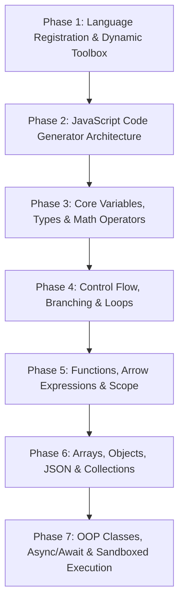

# Implementation Plan: JavaScript Language Module Integration

This document outlines the technical architecture, domain specification, comparative syntax mapping, toolbox schema, and phased development roadmap for implementing the **JavaScript (ES6+) Language Module** in CodeAsthram. 

The objective is to establish JavaScript as a first-class supported programming language alongside Python and Java. Selecting "JavaScript" from the top navigation dropdown dynamically updates the left workspace toolbox, code generator, live preview panel, and execution engine to generate and execute standard, clean JavaScript code.

---

## Architectural Objectives

1. **Dynamic Language & Toolbox Switching**: When the user selects **JavaScript** from the header dropdown, the left-hand category toolbox instantly switches to load `JAVASCRIPT_MODULES`, presenting JavaScript-specific blocks and visual themes.
2. **Standard ES6+ Code Generation Engine**: Provide a modern JavaScript generator (`src/generators/javascript.js`) that produces clean, idiomatic ES6+ code (`let`/`const`, Arrow Functions, Template Literals, ES Classes, Array higher-order methods, and Async/Await).
3. **Full Ergonomic & Feature Parity**: Maintain exact visual UI parity, block layout snapping, real-time code previewing, download capabilities (`script.js`), and sandboxed in-browser execution with Python and Java.

---

## 1. Python vs. Java vs. JavaScript Comparative Mapping

| Feature / Domain | Python Reference | Java Reference | Proposed JavaScript Equivalent (ES6+) | JavaScript Generated Syntax |
|---|---|---|---|---|
| **Execution Entry Point** | Top-level imperative execution | `public class Main { public static void main(...) }` | Script / Module execution scope | Top-level statements / IIFE |
| **Variable Declaration** | Dynamic (`x = 10`) | Static (`int x = 10;`) | Block-scoped (`let`, `const`, `var`) | `let x = 10;`, `const PI = 3.14;` |
| **Type System & Check** | Dynamic (`type(x)`) | Static (`x instanceof Type`) | Dynamic (`typeof x`, `x instanceof Class`) | `typeof x === 'number'`, `arr instanceof Array` |
| **Type Conversion** | `int("123")`, `str(10)` | `Integer.parseInt("123")` | `Number("123")`, `String(10)`, `Boolean(val)` | `Number("123")`, `String(10)`, `parseInt("123", 10)` |
| **Arithmetic Operators** | `+`, `-`, `*`, `/`, `//`, `%`, `**` | `+`, `-`, `*`, `/`, `%`, `Math.pow(a, b)` | `+`, `-`, `*`, `/`, `%`, `**` (Exponentiation) | `a + b;`, `a ** b;`, `Math.floor(a / b);` |
| **Logical & Nullish** | `and`, `or`, `not` | `&&`, `\|\|`, `!` | `&&`, `\|\|`, `!`, `??` (Nullish), `?.` (Optional) | `a && b`, `val ?? 'default'`, `obj?.prop` |
| **Control Branching** | `if`, `elif`, `else`, `match/case` | `if`, `else if`, `else`, `switch` | `if`, `else if`, `else`, `switch` | `if (x > 0) { ... } else if (x === 0) { ... }` |
| **Loops & Iteration** | `for i in range(n):`, `for x in list:` | `for (int i=0;)`, `for (Type x : list)` | `for (let i=0;)`, `for (const x of arr)`, `while` | `for (let i = 0; i < n; i++) { ... }`, `for (const item of list)` |
| **Functions & Closures** | `def add(a, b): return a + b` | `public static int add(int a, int b)` | `function add(a, b)` / Arrow `(a, b) => a + b` | `function add(a, b) { return a + b; }`, `const add = (a, b) => a + b;` |
| **Arrays & Lists** | `list = [1, 2]`, `list.append(3)` | `ArrayList<Object> list = new ArrayList<>()` | Native `Array` (`[1, 2]`, `.push()`, `.pop()`) | `const list = [1, 2]; list.push(3);` |
| **Array Iterators** | `[x*2 for x in list]`, `filter()` | `list.stream().map().collect()` | `.map()`, `.filter()`, `.reduce()`, `.find()` | `list.map(x => x * 2);`, `list.filter(x => x > 0);` |
| **Objects & Dictionaries**| `dict = {"a": 1}`, `dict["a"]` | `HashMap<String, Object> map = new HashMap<>()` | Object Literals (`{ a: 1 }`), `JSON` | `const obj = { a: 1 };`, `obj.a = 2;` |
| **Key-Value Collections** | `dict.keys()`, `dict.values()` | `Map<K,V>`, `Set<T>` | ES6 `Map`, `Set`, `Object.keys()` | `const map = new Map(); map.set("a", 1);` |
| **Strings & Formatting** | `f"Hello {name}"`, `str.split()` | `String.format("Hello %s", name)` | Template Literals (``` `${name}` ```), String APIs | ``` `Hello ${name}`; ```, `str.split(",");` |
| **Console Output** | `print("Hello", x)` | `System.out.println("Hello " + x)` | `console.log()`, `console.error()`, `console.warn()` | `console.log("Hello", x);` |
| **User Input & Prompts** | `input("Enter: ")` | `Scanner sc = new Scanner(System.in)` | Browser `prompt()`, Node `readline` / Mock | `const name = prompt("Enter name:");` |
| **Exceptions & Errors** | `try: ... except Exception as e:` | `try { ... } catch (Exception e) { ... }` | `try { ... } catch (err) { ... } finally { ... }` | `try { ... } catch (err) { console.error(err); }` |
| **OOP & Classes** | `class Car:` `def __init__(self):` | `public class Car { public Car() {} }` | ES6 Class (`class Car { constructor() {} }`) | `class Car { constructor(model) { this.model = model; } }` |
| **Asynchronous Code** | `async def`, `await` | Threads / Futures | Promises, `async` / `await` | `async function fetchData() { const r = await fetch(url); }` |

---

## 2. JavaScript Module & Toolbox Specification (`JAVASCRIPT_MODULES`)

When the user selects **JavaScript**, the left toolbox will render dedicated categories inside `JAVASCRIPT_MODULES` in `src/toolbox/suites.js`:

```javascript
export const JAVASCRIPT_MODULES = [
  {
    name: "JS Variables & Types",
    icon: PiCode,
    themeKey: "js_basics",
    blocks: [
      { type: "js_var_let" },             // let x = 10;
      { type: "js_var_const" },           // const PI = 3.14;
      { type: "js_var_assign" },          // x = 20;
      { type: "js_typeof" },              // typeof x
      { type: "js_type_convert" }         // Number(x), String(x), Boolean(x)
    ]
  },
  {
    name: "JS Operators & Logic",
    icon: PiCalculator,
    themeKey: "js_operators",
    blocks: [
      { type: "js_math_arithmetic" },     // +, -, *, /, %, **
      { type: "js_logic_compare" },       // ===, !==, >, <, >=, <=
      { type: "js_logic_operation" },     // &&, ||, !
      { type: "js_nullish_coalescing" },  // a ?? b
      { type: "js_optional_chaining" }    // obj?.prop
    ]
  },
  {
    name: "JS Control & Loops",
    icon: PiHourglass,
    themeKey: "js_control",
    blocks: [
      { type: "js_if_else" },             // if / else if / else
      { type: "js_switch" },              // switch (val) { case x: ... }
      { type: "js_for_loop" },            // for (let i = 0; i < n; i++)
      { type: "js_for_of" },              // for (const item of array)
      { type: "js_for_in" },              // for (const key in object)
      { type: "js_while" },               // while (condition)
      { type: "js_break_continue" }       // break; / continue;
    ]
  },
  {
    name: "JS Functions & Scope",
    icon: PiFunction,
    themeKey: "js_functions",
    blocks: [
      { type: "js_function_decl" },       // function name(p1, p2) { ... }
      { type: "js_arrow_function" },      // (p1, p2) => { ... }
      { type: "js_function_call" },       // funcName(arg1, arg2)
      { type: "js_return" }               // return value;
    ]
  },
  {
    name: "JS Arrays & Methods",
    icon: PiTreeStructure,
    themeKey: "js_arrays",
    blocks: [
      { type: "js_array_create" },        // const arr = [1, 2, 3];
      { type: "js_array_push_pop" },      // arr.push(val); / arr.pop();
      { type: "js_array_get_set" },       // arr[index] = val;
      { type: "js_array_length" },        // arr.length
      { type: "js_array_map_filter" },    // arr.map(fn) / arr.filter(fn)
      { type: "js_array_includes" }       // arr.includes(val)
    ]
  },
  {
    name: "JS Objects & JSON",
    icon: PiBracketsCurly,
    themeKey: "js_objects",
    blocks: [
      { type: "js_object_create" },       // const obj = { key: value };
      { type: "js_object_get_set" },      // obj.prop = val; / obj['prop']
      { type: "js_json_stringify" },      // JSON.stringify(obj)
      { type: "js_json_parse" }           // JSON.parse(str)
    ]
  },
  {
    name: "JS Maps & Sets",
    icon: PiDatabase,
    themeKey: "js_maps",
    blocks: [
      { type: "js_map_create" },          // const map = new Map();
      { type: "js_map_set_get" },         // map.set(k, v); / map.get(k);
      { type: "js_set_create" },          // const set = new Set();
      { type: "js_set_add_has" }          // set.add(val); / set.has(val);
    ]
  },
  {
    name: "JS OOP & Classes",
    icon: PiBuildings,
    themeKey: "js_classes",
    blocks: [
      { type: "js_class_define" },        // class Car { ... }
      { type: "js_constructor" },         // constructor(model) { ... }
      { type: "js_class_method" },        // methodName() { ... }
      { type: "js_instantiate" },         // const car = new Car("Tesla");
      { type: "js_class_extends" }        // class ElectricCar extends Car
    ]
  },
  {
    name: "JS Console & I/O",
    icon: PiTerminal,
    themeKey: "js_io",
    blocks: [
      { type: "js_console_log" },         // console.log(...)
      { type: "js_console_error" },       // console.error(...)
      { type: "js_prompt_input" },        // prompt("Enter text:")
      { type: "js_alert" }                // alert("Message")
    ]
  },
  {
    name: "JS Async & Exceptions",
    icon: PiLightning,
    themeKey: "js_async",
    blocks: [
      { type: "js_try_catch" },           // try { ... } catch (err) { ... }
      { type: "js_throw_error" },         // throw new Error("msg");
      { type: "js_async_func" },          // async function() { ... }
      { type: "js_await" }                // await promise;
    ]
  }
];
```

---

## 3. Code Generation Engine (`src/generators/javascript.js`)

Unlike Java, JavaScript does not require a mandatory main class wrapper. However, to guarantee valid execution and scope isolation, the `JavascriptGenerator` output structure will format workspace blocks into clean ES6+ code:

```text
+-------------------------------------------------------------+
| JavaScript Generator Output Structure                       |
+-------------------------------------------------------------+
| 1. Use Strict Directive (Optional / Default)                |
|    'use strict';                                            |
|                                                             |
| 2. Class & Function Definitions (Top-level scope)           |
|    class Calculator {                                       |
|        add(a, b) { return a + b; }                          |
|    }                                                        |
|                                                             |
| 3. Main Script Execution Sequence                           |
|    const calc = new Calculator();                           |
|    const sum = calc.add(5, 10);                             |
|    console.log("Sum:", sum);                                |
+-------------------------------------------------------------+
```

---

## 4. Phased Development & Implementation Roadmap

Implementing the full JavaScript language module requires a multi-phase development strategy to ensure zero crashes, proper block layout snapping, accurate syntax generation, and reliable client-side execution.



---

### Phase 1: Language Registration & Dynamic Toolbox Suite
- **Goal**: Enable selection of "JavaScript" in the top language dropdown and dynamically render `JAVASCRIPT_MODULES` in the left category panel.
- **Sub-phase 1.1**: Add `JAVASCRIPT_MODULES` category suite definition to `src/toolbox/suites.js`.
- **Sub-phase 1.2**: Update `getToolboxConfig` in `src/toolbox/toolbox.jsx` to dynamically load JavaScript categories when `currentLanguage === 'javascript'`.
- **Sub-phase 1.3**: Add JavaScript theme keys (`js_basics`, `js_operators`, `js_control`, `js_functions`, `js_arrays`, `js_objects`, `js_classes`, `js_io`) to `src/styles/toolbox.css` for distinct visual styling.

---

### Phase 2: JavaScript Code Generator Engine Setup
- **Goal**: Create the core generator instance `JavascriptGenerator` in `src/generators/javascript.js`.
- **Sub-phase 2.1**: Instantiate `Blockly.Generator` customized for JavaScript (`JavascriptGenerator`).
- **Sub-phase 2.2**: Implement operator precedence definitions (`Order.ATOMIC`, `Order.MEMBER`, `Order.FUNCTION_CALL`, `Order.ADDITION`, `Order.ASSIGNMENT`, etc.).
- **Sub-phase 2.3**: Build workspace-to-code formatting methods (`workspaceToCode`, statement indentation prefixing, semicolon formatting).

---

### Phase 3: Core Variables, Data Types & Operator Blocks
- **Goal**: Implement block definitions and generators for `let`, `const`, variable assignment, `typeof`, type conversions, and arithmetic/logical operators.
- **Sub-phase 3.1**: Implement `js_var_let`, `js_var_const`, `js_var_assign` blocks and generators in `src/generators/javascript/variables.js`.
- **Sub-phase 3.2**: Implement `js_math_arithmetic` (`+`, `-`, `*`, `/`, `%`, `**`) in `src/generators/javascript/math.js`.
- **Sub-phase 3.3**: Implement strict comparison operators (`===`, `!==`, `>`, `<`, `>=`, `<=`) and logical operators (`&&`, `||`, `!`) in `src/generators/javascript/logic.js`.

---

### Phase 4: Control Structures, Branching & Loop Modules
- **Goal**: Implement `if / else if / else`, `switch-case`, `for`, `for...of`, `for...in`, `while`, and flow statements (`break`, `continue`).
- **Sub-phase 4.1**: Build `js_if_else` and `js_switch` blocks and generators in `src/generators/javascript/control.js`.
- **Sub-phase 4.2**: Build standard `for (let i=0; i<n; i++)`, `for (const item of arr)`, and `for (const key in obj)` loop blocks in `src/generators/javascript/loops.js`.
- **Sub-phase 4.3**: Integrate flow control blocks (`break;`, `continue;`).

---

### Phase 5: Functions, Scope & Arrow Expressions
- **Goal**: Implement standard function declarations, arrow functions `(args) => { ... }`, return statements, and procedure calls.
- **Sub-phase 5.1**: Build `js_function_decl` and `js_arrow_function` blocks in `src/generators/javascript/functions.js`.
- **Sub-phase 5.2**: Build `js_function_call` and `js_return` generators.
- **Sub-phase 5.3**: Support variable scoping within function bodies.

---

### Phase 6: Arrays, Objects, JSON & Collections
- **Goal**: Support Native Array operations (`.push()`, `.pop()`, `.map()`, `.filter()`), Object literals (`{ key: val }`), `JSON.stringify`, `JSON.parse`, `Map`, and `Set`.
- **Sub-phase 6.1**: Build Array creation and modification blocks in `src/generators/javascript/arrays.js`.
- **Sub-phase 6.2**: Build Array higher-order iterator blocks (`.map()`, `.filter()`, `.reduce()`).
- **Sub-phase 6.3**: Build Object creation, property access (`obj.prop`, `obj[key]`), and `JSON` utility blocks in `src/generators/javascript/objects.js`.
- **Sub-phase 6.4**: Build ES6 `Map` and `Set` blocks in `src/generators/javascript/collections.js`.

---

### Phase 7: OOP Classes, Async/Await & Execution Integration
- **Goal**: Support ES6 Classes (`class Car`, `constructor`, methods, `extends`), Async/Await (`async function`, `await`), Console I/O, and in-browser execution runner.
- **Sub-phase 7.1**: Build ES6 Class definition, constructor, method, and instantiation blocks in `src/generators/javascript/oop.js`.
- **Sub-phase 7.2**: Build Async function and `await` expression blocks.
- **Sub-phase 7.3**: Build Console I/O blocks (`console.log`, `console.error`, `prompt`, `alert`).
- **Sub-phase 7.4**: Implement `executeJSCode()` runtime runner in `src/utils/jsRunner.js` with captured `console.log` output for live code execution in the Code Panel modal.

---

## 5. Verification & Quality Assurance Plan

### Automated Test Suites
- Create `scratch/test_js_generation.js` to verify block code generation for all JavaScript categories.
- Validate generated code against Node.js runtime evaluation without syntax errors.

### Manual UI Verification
- Select **JavaScript** from the header dropdown and verify that `JAVASCRIPT_MODULES` correctly loads in the left category toolbox.
- Verify block drag-and-drop, layout snapping, live code panel previewing, file download (`script.js`), and run execution output display.
